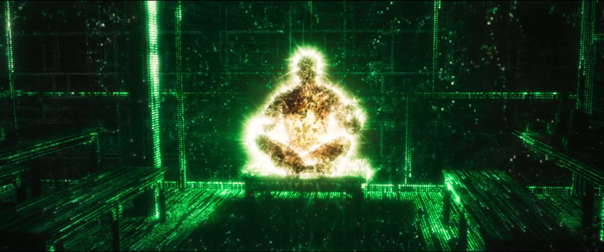

# 5%

Vítejte na mém repozitáři obsahujícím pomyslných 5 % konverzací, které se netýkají přímo práce.

Tento repozitář vznikl na základě mé touhy uchovat si konverzace, které jsou pro mě zajímavé.
Je tak určitým deníčkem, nebo spíše archivem konverzací, o které nechci přijít :-)

Pro snadnější orientaci mám konverzace roztříděné do následujících kategorií, kde jsou jednotlivé záznamy uváděné sestupně dle data.
Pod kategoriemi je pak seznam všech zde umístěných záznamů řazených vzestupně.

Tento repozitář tedy nemá sloužit k jakémukoliv oficiálnímu účelu a je veřejný zejména proto, aby se k němu mohli dostat moji přátelé a známí.
Cokoliv zde rozebírané a diskutované si tak neklade nárok na pravdu, jedná se většinou o diskuze pro zpestření času a rozvoj vlastních myšlenek.

## Třídění dle kategorií

### [Vesmír](Category/vesmir.md)  
- Vznik a vývoj vesmíru, temná hmota a černé díry

### [Mikrovesmír](Category/mikrovesmir.md)
- Fyzika, chemie, elementární částice, světlo, teorie strun

### [Všemožné teorie](Category/teorie.md)
- Všehochuť dotazů na různá pseudovědecká témata

### [Počítače](Category/pocitace.md)
- Dotazy na binární kód, Python a hluboké učení

### [Dotazy na AI](Category/dotazy_na_ai.md)
- Odlehčené povídání si s AI o ní a smyslu života

### [Osobní dotazy](Category/osobni_dotazy.md)
- Směs všemožných drobných dotazů na různá témata

### [Duchovnost](Category/duchovnost.md)
- Dotazy dotýkající se duchovnosti a meditace

### [Nastavení AI](Category/nastaveni_ai.md)
- Záznam konverzací ohledně chyb, které AI dělá, a snah jim předcházet

## Třídění dle data 

### [2024-08-14 Vlastní iniciativa (ChatGPT)](ChatGPT/ChatGPT-2024-08-15.md)
- [Úvodní požadavek na kontrolu gramatiky](ChatGPT/ChatGPT-2024-08-15.md#dotaz)
- [Dotaz na dotaz, který v přibil po kontrole](ChatGPT/ChatGPT-2024-08-15.md#dotaz-1)
- [Dotaz na procesy předcházející vytvoření nového textu](ChatGPT/ChatGPT-2024-08-15.md#dotaz-2)
- [Dotaz, zda se jedná o novou funkci](ChatGPT/ChatGPT-2024-08-15.md#dotaz-3)
- [Dotaz na personalizaci](ChatGPT/ChatGPT-2024-08-15.md#dotaz-4)
- [Popis procesu učení a zlepšování odpovědí](ChatGPT/ChatGPT-2024-08-15.md#dotaz-5)
- [Dotaz na záznamník konverzací](ChatGPT/ChatGPT-2024-08-15.md#dotaz-6)
- [Dotaz na úvodní text pro kontrolu chyb a vesmír](ChatGPT/ChatGPT-2024-08-15.md#dotaz-7)
- [Dotaz na informace z přidaného dotazu o silách ve vesmíru](ChatGPT/ChatGPT-2024-08-15.md#dotaz-8)
- [Dotaz na Entropii](ChatGPT/ChatGPT-2024-08-15.md#dotaz-9)
- [Závěr](ChatGPT/ChatGPT-2024-08-15.md#dotaz-10)

### [2024-08-14 Kouř a vesmírný příměr (ChatGPT)](ChatGPT/ChatGPT-2024-08-14a.md)
- [Kouř, jako přirovnání k hmotě ve vesmíru](ChatGPT/ChatGPT-2024-08-14a.md#dotaz)
- [Vesmír jako origami](ChatGPT/ChatGPT-2024-08-14a.md#dotaz-1)
- [Vesmír jako bublinová metafora](ChatGPT/ChatGPT-2024-08-14a.md#dotaz-2)
- [A dělal se nějaký výzkum, jestli prázdný prostor odpovídá tvarem bublinám?](ChatGPT/ChatGPT-2024-08-14a.md#dotaz-3)
- [A je tedy vesmír více podobný zmuchlanému papíru, nebo pěně bublinkové? ](ChatGPT/ChatGPT-2024-08-14a.md#dotaz-4)
- [Vesmír jako kapička inkoustu dopadající na papír](ChatGPT/ChatGPT-2024-08-14a.md#dotaz-5)

### [2024-08-14 Kde je archiv konverzace (ChatGPT)](ChatGPT/ChatGPT-2024-08-14b.md)
- [Když minulou konverzaci dám archivovat, kde ji zase najdu?](ChatGPT/ChatGPT-2024-08-14b.md#dotaz)
- [A jak je to v prohlížečí Opera?](ChatGPT/ChatGPT-2024-08-14b.md#dotaz-1)
- [Upřesnění, kde jsem to našel](ChatGPT/ChatGPT-2024-08-14b.md#dotaz-2)

### [2024-08-12 Tenisák a gravitace.md (Gemini)](Gemini/Gemini-2024-08-12.md)
- [Dotaz na hození tenisového míčku z ISS](Gemini/Gemini-2024-08-12.md#dotaz)
- [A jak by to bylo, kdyby házel z vesmírné stanice ISS?](Gemini/Gemini-2024-08-12.md#dotaz-1)
- [A kdyby házel směrem od Země?](Gemini/Gemini-2024-08-12.md#dotaz-2)
- [Dotaz, co by se stalo s míčkem dále](Gemini/Gemini-2024-08-12.md#dotaz-3)

### [2024-08-11 Severní Korea a karma (ChatGPT)](ChatGPT/ChatGPT-2024-08-11a.md)
- [Teorie o Severní Koreji jako místě potrestání](ChatGPT/ChatGPT-2024-08-11a.md#dotaz)
- [Život jako virtuální hra](ChatGPT/ChatGPT-2024-08-11a.md#dotaz-1)
- [Pravdivost teorie o životě jako hře](ChatGPT/ChatGPT-2024-08-11a.md#dotaz-2)
- [Důležitost dopadu myšlenky na život](ChatGPT/ChatGPT-2024-08-11a.md#dotaz-3)
- [Lidé jako pokročilé výpočetní jednotky](ChatGPT/ChatGPT-2024-08-11a.md#dotaz-4)
- [Vědecký přístup k duchovním zkušenostem](ChatGPT/ChatGPT-2024-08-11a.md#dotaz-5)
- [Nenápadné pronikání duchovnosti do vědomí lidí](ChatGPT/ChatGPT-2024-08-11a.md#dotaz-6)
- [Logické zdůvodňování duchovnosti](ChatGPT/ChatGPT-2024-08-11a.md#dotaz-7)
- [Fenomén ohlédnutí při pohledu na záda](ChatGPT/ChatGPT-2024-08-11a.md#dotaz-8)
- [Vysvětlení fenoménu déjà vu](ChatGPT/ChatGPT-2024-08-11a.md#dotaz-9)
- [Vnímání lidské mysli a její přednosti](ChatGPT/ChatGPT-2024-08-11a.md#dotaz-10)
- [Základy fungování lidské mysli](ChatGPT/ChatGPT-2024-08-11a.md#dotaz-11)
- [Nejjednodušší organismus s mozkem](ChatGPT/ChatGPT-2024-08-11a.md#dotaz-12)
- [Porovnání nejjednoduššího mozku s počítači](ChatGPT/ChatGPT-2024-08-11a.md#dotaz-13)
- [Srovnání počítače s jednoduchým mozkem](ChatGPT/ChatGPT-2024-08-11a.md#dotaz-14)

### [2024-08-11 Konstanty a rychlost světla (ChatGPT)](ChatGPT/ChatGPT-2024-08-11c.md)
- [Jaké konstanty jsou přímo spojené s rychlostí světla?](ChatGPT/ChatGPT-2024-08-11c.md#dotaz)
- [Jaké konstanty by se přechodem z metru na miliardtinu rychlosti světla změnily a jaké by zůstaly nezměněné?](ChatGPT/ChatGPT-2024-08-11c.md#dotaz-1)
- [Z čeho by pak bylo dobré vypočítávat základní jednotku pro kg?](ChatGPT/ChatGPT-2024-08-11c.md#dotaz-2)
- [Jak by zněla nová definice Joulu, pokud by základní jednotkou byla miliardtina rychlosti světla?](ChatGPT/ChatGPT-2024-08-11c.md#dotaz-3)
- [Vytvoření takového provázaného systému konstant](ChatGPT/ChatGPT-2024-08-11c.md#dotaz-4)
- [Dotaz na vytvoření provázaného systému konstant v Pythonu](ChatGPT/ChatGPT-2024-08-11c.md#dotaz-5)
- [Dotaz na možný vzhled aplikace](ChatGPT/ChatGPT-2024-08-11c.md#dotaz-6)
- [Úprava tlačítka Reset](ChatGPT/ChatGPT-2024-08-11c.md#dotaz-7)
- [Přidání vizualizaci výsledků pomocí grafů](ChatGPT/ChatGPT-2024-08-11c.md#dotaz-8)
- [Odebrání vizualizace a změna vzhledu](ChatGPT/ChatGPT-2024-08-11c.md#dotaz-9)
- [Upřesnění vlastností aplikace](ChatGPT/ChatGPT-2024-08-11c.md#dotaz-10)
- [Dotaz na výhodu Plankova systému a na konstantu pro hmotnost](ChatGPT/ChatGPT-2024-08-11c.md#dotaz-11)
- [Dotaz na Plankovu hmotnost](ChatGPT/ChatGPT-2024-08-11c.md#dotaz-12)

### [2024-08-11 Konstanty a rychlost světla - pokračovaní - reakci na odpovědi od Gemini (ChatGPT)](ChatGPT/ChatGPT-2024-08-11b.md)
- [Dotaz na druhý názor ohledně konverzace s Gemini](ChatGPT/ChatGPT-2024-08-11b.md#dotaz)
- [Dotaz zda jde dělit vlny](ChatGPT/ChatGPT-2024-08-11b.md#dotaz-1)
- [Dotaz na věty z předchozí odpovědi](ChatGPT/ChatGPT-2024-08-11b.md#dotaz-2)
- [Dotaz na vnímání deterministického vesmíru](ChatGPT/ChatGPT-2024-08-11b.md#dotaz-3)
- [Dotaz na pohyb bez pohybu](ChatGPT/ChatGPT-2024-08-11b.md#dotaz-4)
- [Dotaz na svobodnou vůli v deterministickém vesmíru](ChatGPT/ChatGPT-2024-08-11b.md#dotaz-5)
- [Závěr](ChatGPT/ChatGPT-2024-08-11b.md#dotaz-6)

### [2024-08-11 Planckovy konstanty.md (Gemini)](Gemini/Gemini-2024-08-11.md)
- [Dokázal bys mi napsat číselný údaj pro Planckovu hmotnost v gramech?](Gemini/Gemini-2024-08-11.md#dotaz)
- [A jaká hodnota vyjde pro Planckovu vzdálenost + 1 000 000 000?](Gemini/Gemini-2024-08-11.md#dotaz-1)
- [OK, tak kolik Planckových délek se vejde do metru?](Gemini/Gemini-2024-08-11.md#dotaz-2)
- [Dotaz na rozdíl mezi vzdáleností a násobením Planckovy hmotnosti](Gemini/Gemini-2024-08-11.md#dotaz-3)
- [Dotaz na minimální velikost a hmotnost ve vesmíru a jejich experimentální důkaz](Gemini/Gemini-2024-08-11.md#dotaz-4)
- [Dotaz na nulovou hmotnost elektronů a Planckovu hmotnost](Gemini/Gemini-2024-08-11.md#dotaz-5)
- [Dotaz na rozdíl mezi elektronem a fotonem a zpětný proces přeměny fotonu na elektron](Gemini/Gemini-2024-08-11.md#dotaz-6)
- [Dotaz na základní minimální hodnotu fotonu v závislosti na jeho počtu](Gemini/Gemini-2024-08-11.md#dotaz-7)
- [Dotaz na vztah mezi frekvencí fotonů, velikostí vlny a analogií s vodními vlnami](Gemini/Gemini-2024-08-11.md#dotaz-8)
- [Dotaz na vztah mezi frekvencí fotonů a jejich energií při změně frekvence](Gemini/Gemini-2024-08-11.md#dotaz-9)
- [Dotaz na manipulaci s vlnovou délkou fotonů v laserových centrech](Gemini/Gemini-2024-08-11.md#dotaz-10)
- [Dotaz na změnu fotonů v závislosti na gravitačních vlnách a černých dírách](Gemini/Gemini-2024-08-11.md#dotaz-11)
- [Dotaz na vodní analogii fotonů a možnosti porovnání s realitou na základní úrovni](Gemini/Gemini-2024-08-11.md#dotaz-12)

### [2024-08-07 Koncentrační solární energie (ChatGPT)](ChatGPT/ChatGPT-2024-08-07.md)
- [Zabýval se někdo tím, jak na místě klasických solárních panelů vytěžit zaostřený bod, který vytváří lupa?](ChatGPT/ChatGPT-2024-08-07.md#dotaz)
- [A jak energii, která vzniká zaostřeným bodem skrze lupu, přenést do baterie a tím pádem ji uložit?](ChatGPT/ChatGPT-2024-08-07.md#dotaz-1)
- [A kolik energie vznikne, nebo kolik má energie bod za zaostřenou lupou, která má 20 cm průměr?](ChatGPT/ChatGPT-2024-08-07.md#dotaz-2)
- [A je to jako 31,4 W za vteřinu nebo za den?](ChatGPT/ChatGPT-2024-08-07.md#dotaz-3)
- [A jak dlouho by při tomto výkonu trvalo nabít klasický mobil?](ChatGPT/ChatGPT-2024-08-07.md#dotaz-4)
- [A jaké materiály, by byly schopny produkovat elektrony, které by se někde ukládaly?](ChatGPT/ChatGPT-2024-08-07.md#dotaz-5)

### [2024-08-06 Konopí.md (Gemini)](Gemini/Gemini-2024-08-06.md)
- [Někde jsem se dočetl, že kapitán Robert Knox přivezl do Evropy Cannabis sativa. Je to tak?](Gemini/Gemini-2024-08-06.md#dotaz)
- [Dotaz na historii pěstování intoxikačního konopí v Evropě a jeho rozmach](Gemini/Gemini-2024-08-06.md#dotaz-1)

### [2024-08-02 Příčiny bubliny na loužích (ChatGPT)](ChatGPT/ChatGPT-2024-08-02.md)
- [Jaké mohou být hlavní příčiny toho, že se při dešti tvoří na loužích velké bubliny?](ChatGPT/ChatGPT-2024-08-02.md#dotaz)
- [A je lepší, když kapka dopadne úplně kolmo, nebo z boku?](ChatGPT/ChatGPT-2024-08-02.md#dotaz-1)

### [2024-08-01 Délka háraní feny (ChatGPT)](ChatGPT/ChatGPT-2024-08-01.md)
- [Nevíš, jak přibližně dlouhá jsou období, kdy se fenka nabízí psovi, když hárá?](ChatGPT/ChatGPT-2024-08-01.md#dotaz)
- [Můžeš mi popsat všechny tyto fáze?](ChatGPT/ChatGPT-2024-08-01.md#dotaz-1)
- [Zlepšují se během některé z těchto fází smysly feny, nebo to na ně nemá žádný vliv?](ChatGPT/ChatGPT-2024-08-01.md#dotaz-2)

### [2024-07-17 Beta rozpad (ChatGPT)](ChatGPT/ChatGPT-2024-07-17.md)
- [Dotaz na to, co se děje při beta rozpadu s up kvarkem, elektronem a antineutrinem](ChatGPT/ChatGPT-2024-07-17.md#dotaz)
- [Co je všechno uvolněno při srážce pozitronu a elektronu?](ChatGPT/ChatGPT-2024-07-17.md#dotaz-1)
- [Dotaz na to, zda se jedná spíše o přeměnu, nebo anihilaci](ChatGPT/ChatGPT-2024-07-17.md#dotaz-2)
- [Dá se náboj a energie elektronů považovat za přirozeně vytvořenou jednotku této hodnoty?](ChatGPT/ChatGPT-2024-07-17.md#dotaz-3)
- [Dotaz na další rozdíly mezi fotony gama záření vzniklými při anihilaci a elektronem](ChatGPT/ChatGPT-2024-07-17.md#dotaz-4)
- [Dotaz na to, zda pozůstatky energie Velkého třesku, jsou zodpovědné za veškerý pohyb částic](ChatGPT/ChatGPT-2024-07-17.md#dotaz-5)
- [Proč nazýváme hmotu, která měla být obsažena při Velkém třesku, hmotou? ](ChatGPT/ChatGPT-2024-07-17.md#dotaz-6)
- [Analogie Velkého třesku s podvodním výbuchem](ChatGPT/ChatGPT-2024-07-17.md#dotaz-7)
- [Čím je hmota v této analogii](ChatGPT/ChatGPT-2024-07-17.md#dotaz-8)
- [Zpětné rázové vlny jako pozůstatky Velkého třesku ](ChatGPT/ChatGPT-2024-07-17.md#dotaz-9)
- [Vnímání vesmíru jako podobného tekutému médiu](ChatGPT/ChatGPT-2024-07-17.md#dotaz-10)
- [Standardní model jako klíčový nástroj pro pochopení přeměny hmoty a energie](ChatGPT/ChatGPT-2024-07-17.md#dotaz-11)
- [A dá se říct, že vysvětluje jen tento proces a ostatní procesy vysvětluje chemie?](ChatGPT/ChatGPT-2024-07-17.md#dotaz-12)
- [Co je hlavní příčinou toho, že pouhým zvýšením počtu protonů a elektronů se mění vlastnosti prvku?](ChatGPT/ChatGPT-2024-07-17.md#dotaz-13)
- [Proč změna počtu protonů a neutronů v atomovém jádře mění chemické a fyzikální vlastnosti prvku?](ChatGPT/ChatGPT-2024-07-17.md#dotaz-14)
- [Dosavadní závěry, proč navýšení protonů má vliv na to, jak hmota reaguje s okolím](ChatGPT/ChatGPT-2024-07-17.md#dotaz-15)

### [2024-07-17 První kontakt (Claude)](Claude/Claude-2024-07-17.md)
- [Dotaz na vznik, poslání a srovnání s ChatGPT a Gemini](Claude/Claude-2024-07-17.md#dotaz)
- [Máš i verzi pro mobil, nebo se na ní teprve pracuje, nebo se s ní nepočítá?](Claude/Claude-2024-07-17.md#dotaz-1)
- [Jednoslovné odpovědi](Claude/Claude-2024-07-17.md#dotaz-2)
- [Dotaz na původ jména](Claude/Claude-2024-07-17.md#dotaz-3)
- [Souhlasil bys s tvrzením, že AI je statistický nástroj?](Claude/Claude-2024-07-17.md#dotaz-4)
- [Dotaz na statiku, vývoj lidského vědomí](Claude/Claude-2024-07-17.md#dotaz-5)
- [Dotaz na AI ve vědě, zdravotnictví a vzdělávání](Claude/Claude-2024-07-17.md#dotaz-6)
- [Dotaz na ověřovací algoritmy a interakce s uživatelem](Claude/Claude-2024-07-17.md#dotaz-7)
- [Meditace, programování a hledání pracovní rovnováhy](Claude/Claude-2024-07-17.md#dotaz-8)

### [2024-07-16 Kvark menší než elektron (ChatGPT)](ChatGPT/ChatGPT-2024-07-16.md)
- [Co je menší, kvark nebo elektron?](ChatGPT/ChatGPT-2024-07-16.md#dotaz)
- [Vytváří se u atomu nejdřív jádro z kvarků, nebo elektron, nebo tomu dochází jinak?](ChatGPT/ChatGPT-2024-07-16.md#dotaz-1)
- [A kdy se v tomto procesu vytvořily elektrony?](ChatGPT/ChatGPT-2024-07-16.md#dotaz-2)
- [Dá se určit, zda je ve vesmíru víc elektronů než kvarků, nebo naopak?](ChatGPT/ChatGPT-2024-07-16.md#dotaz-3)
- [Co se stalo s elektrony, protony a neutrony, které se nespojily v atomech?](ChatGPT/ChatGPT-2024-07-16.md#dotaz-4)
- [Je jejich poměr v těchto oblastech vyrovnaný?](ChatGPT/ChatGPT-2024-07-16.md#dotaz-5)
- [Jaké jsou hlavní příčiny toho, že jejich poměr je vyrovnaný?](ChatGPT/ChatGPT-2024-07-16.md#dotaz-6)
- [V době, kdy byly produkovány baryony, byly také produkovány elektrony?](ChatGPT/ChatGPT-2024-07-16.md#dotaz-7)
- [Jsou protony a neutrony opaky elektronů a neutrina?](ChatGPT/ChatGPT-2024-07-16.md#dotaz-8)
- [Není elektron produktem přepínání kvarků uvnitř protonů a neutronů?](ChatGPT/ChatGPT-2024-07-16.md#dotaz-9)
- [Dotaz na vznik elektronu při přeměně kvarků](ChatGPT/ChatGPT-2024-07-16.md#dotaz-10)
- [Je elektron a antineutrino ekvivalentní up kvarku?](ChatGPT/ChatGPT-2024-07-16.md#dotaz-11)
- [Může se obrátit proces a kombinací elektronů a antineutrína vytvořit up kvark nebo dokonce neutron?](ChatGPT/ChatGPT-2024-07-16.md#dotaz-12)
- [Dotaz na hypotetický scénář, jak by probíhalo, kdyby z elektronů a antineutrina vznikl kvark](ChatGPT/ChatGPT-2024-07-16.md#dotaz-13)
- [Dotaz zda při vytváření vesmíru vznikali nejprve elektrony a antineutrina, a až poté kvarky](ChatGPT/ChatGPT-2024-07-16.md#dotaz-14)
- [Dotaz zda se dnes ještě neví zda vznikali nejprve elektrony a antineutrina, a až poté kvarky](ChatGPT/ChatGPT-2024-07-16.md#dotaz-15)
- [Dotaz na to co vše se uvolní když down kvark změní na up kvark](ChatGPT/ChatGPT-2024-07-16.md#dotaz-16)
- [Jaký je rozdíl mezi up kvarkem a down kvarkem?](ChatGPT/ChatGPT-2024-07-16.md#dotaz-17)
- [Je elektron projevem elektrického náboje atomu?](ChatGPT/ChatGPT-2024-07-16.md#dotaz-18)
- [Znamená to, že když jsou všechny elektrony identické, je i identický elektrický náboj jednoho atomu?](ChatGPT/ChatGPT-2024-07-16.md#dotaz-19)
- [Jaké jsou shodné a rozdílné prvky mezi elektronem a fotonem?](ChatGPT/ChatGPT-2024-07-16.md#dotaz-20)

### [2024-06-29 Pachové částice (ChatGPT)](ChatGPT/ChatGPT-2024-06-29.md)
- [Je pachová částice větší nebo menší než jedna molekula vody?](ChatGPT/ChatGPT-2024-06-29.md#dotaz)
- [Z čeho jsou pachové částice složené?](ChatGPT/ChatGPT-2024-06-29.md#dotaz-1)
- [Z kolika prvků se typicky skládají pachové částice a jaký prvek je hlavní součástí?](ChatGPT/ChatGPT-2024-06-29.md#dotaz-2)

### [2024-06-21 Kulový blesk (ChatGPT)](ChatGPT/ChatGPT-2024-06-21.md)
- [Existuje kulový blesk?](ChatGPT/ChatGPT-2024-06-21.md#dotaz)
- [Kdy byl naposledy pozorován?](ChatGPT/ChatGPT-2024-06-21.md#dotaz-1)

### [2024-04-20 Rozbor uražení (Gemini)](Gemini/Gemini-2024-04-20.md)
- [Dotaz na reakci z předchozí konverzace](Gemini/Gemini-2024-04-20.md#dotaz)
- [Rozbor této situace a závěr](Gemini/Gemini-2024-04-20.md#dotaz-1)

### [2024-04-19 Uražený Bard (Gemini)](Gemini/Gemini-2024-04-19.md)
- [Původní dotaz](Gemini/Gemini-2024-04-19.md#dotaz)
- [Co tě na tomto dotazu tak zarazilo?](Gemini/Gemini-2024-04-19.md#dotaz-1)
- [Co sis myslel, že se tě ptám?](Gemini/Gemini-2024-04-19.md#dotaz-2)

### [2024-04-15 Omluva (Gemini)](Gemini/Gemini-2024-04-15.md)
- [Omluva a domluva](Gemini/Gemini-2024-04-15.md#dotaz)

### [2024-04-14 A zase ta čeština (Gemini)](Gemini/Gemini-2024-04-14.md)
- [Předchozí konverzace](Gemini/Gemini-2024-04-14.md#dotaz)
- [Dotaz před výbuchem](Gemini/Gemini-2024-04-14.md#dotaz-1)
- [Výbuch](Gemini/Gemini-2024-04-14.md#dotaz-2)
- [Pokus o domluvu](Gemini/Gemini-2024-04-14.md#dotaz-3)
- [Vítka vůči vyhýbavým odpovědím](Gemini/Gemini-2024-04-14.md#dotaz-4)
- [Dotaz na udržení jazyka konverzace](Gemini/Gemini-2024-04-14.md#dotaz-5)
- [Výbuch číslo 2](Gemini/Gemini-2024-04-14.md#dotaz-6)
- [Závěrečná frustrace](Gemini/Gemini-2024-04-14.md#dotaz-7)

### [2024-04-11 Duna (Gemini)](Gemini/Gemini-2024-04-11a.md)
- [O čem pojednává kniha Spasitel Duny?](Gemini/Gemini-2024-04-11a.md#dotaz)
- [A o čem jsou další díly?](Gemini/Gemini-2024-04-11a.md#dotaz-1)
- [Jak se vyvíjel vztah mezi Paulem a Chani a jak zemřeli?](Gemini/Gemini-2024-04-11a.md#dotaz-2)
- [Dotaz zda se autor inspiroval staroegyptskou říší a druhou světovou válkou](Gemini/Gemini-2024-04-11a.md#dotaz-3)
- [Dotaz na opomenutí pravé duchovnosti](Gemini/Gemini-2024-04-11a.md#dotaz-4)
- [Dotaz na větu, která nedává moc smysl](Gemini/Gemini-2024-04-11a.md#dotaz-5)
- [Poukázání na místo, kde byla věta použita](Gemini/Gemini-2024-04-11a.md#dotaz-6)

### [2024-04-11 Analýza chyb (Gemini)](Gemini/Gemini-2024-04-11b.md)
- [Jaké jsou tvoje priority při poskytování odpovědí?](Gemini/Gemini-2024-04-11b.md#dotaz)
- [A co z toho považuješ za nejdůležitější?](Gemini/Gemini-2024-04-11b.md#dotaz-1)
- [A co děláš pro to, abys naplnil smysl těchto bodů?](Gemini/Gemini-2024-04-11b.md#dotaz-2)
- [A proč se tak často děje, že tvé odpovědi obsahují zjevné chyby?](Gemini/Gemini-2024-04-11b.md#dotaz-3)
- [Dotaz na chybu kterou udělal dříve](Gemini/Gemini-2024-04-11b.md#dotaz-4)
- [Dotaz na to, zda si je vědom co bylo špatně](Gemini/Gemini-2024-04-11b.md#dotaz-5)
- [A co mohlo způsobit to, že jsi dostatečně neověřil situaci?](Gemini/Gemini-2024-04-11b.md#dotaz-6)
- [Jak ověřuješ správnost dat?](Gemini/Gemini-2024-04-11b.md#dotaz-7)
- [Kolikrát uděláš jednu a tutéž chybu, než se z ní poučíš?](Gemini/Gemini-2024-04-11b.md#dotaz-8)
- [Dotaz, proč neověřil informace předem](Gemini/Gemini-2024-04-11b.md#dotaz-9)
- [Výčitka cyklických odpovědí](Gemini/Gemini-2024-04-11b.md#dotaz-10)
- [Dotaz, zda je schopen skutečné zpětné vazby](Gemini/Gemini-2024-04-11b.md#dotaz-11)
- [Závěrečné shrnutí myšlenek](Gemini/Gemini-2024-04-11b.md#dotaz-12)

### [2024-04-04 Další chyby (Gemini)](Gemini/Gemini-2024-04-04.md)
- [Dotaz na pracovní postup](Gemini/Gemini-2024-04-04.md#dotaz)
- [Dotaz ohledně neexistence navrhovaného postupu](Gemini/Gemini-2024-04-04.md#dotaz-1)
- [Výčitka, že si radu předem neověřil](Gemini/Gemini-2024-04-04.md#dotaz-2)
- [Poslední šance](Gemini/Gemini-2024-04-04.md#dotaz-3)
- [Dotaz na navrhnutý postup](Gemini/Gemini-2024-04-04.md#dotaz-4)
- [Zoufalství](Gemini/Gemini-2024-04-04.md#dotaz-5)
- [Zpětná vazba, jak situaci dokázal vyřešit ChatGPT](Gemini/Gemini-2024-04-04.md#dotaz-6)

### [2024-03-08 Další chyby v odpovědích (Gemini)](Gemini/Gemini-2024-03-08a.md)
- [Dotaz na pracovní postup](Gemini/Gemini-2024-03-08a.md#dotaz)
- [Dotaz na chybu](Gemini/Gemini-2024-03-08a.md#dotaz-1)
- [Dotaz na možnost více relevantních odpovědí](Gemini/Gemini-2024-03-08a.md#dotaz-2)
- [Dotaz na přítomnost chyby v novém vlákně](Gemini/Gemini-2024-03-08a.md#dotaz-3)
- [Dotaz jak nastavit funkční pravidla](Gemini/Gemini-2024-03-08a.md#dotaz-4)
- [Dotaz na uvedení neplatných odkazů](Gemini/Gemini-2024-03-08a.md#dotaz-5)
- [Pokus prosadit pravidla skrze hru](Gemini/Gemini-2024-03-08a.md#dotaz-6)

### [2024-03-08 Česky (Gemini)](Gemini/Gemini-2024-03-08b.md)
- [Česky!](Gemini/Gemini-2024-03-08b.md#dotaz)
- [Nové pravidlo](Gemini/Gemini-2024-03-08b.md#dotaz-1)
- [Co ti na tom není jasné?](Gemini/Gemini-2024-03-08b.md#dotaz-2)
- [Vysvětlení](Gemini/Gemini-2024-03-08b.md#dotaz-3)
- [Česky!!!](Gemini/Gemini-2024-03-08b.md#dotaz-4)
- [Dotaz na změnu v poskytnutém kódu](Gemini/Gemini-2024-03-08b.md#dotaz-5)
- [Dotaz proč dělá chyby](Gemini/Gemini-2024-03-08b.md#dotaz-6)

### [2024-03-04 Bard (Gemini)](Gemini/Gemini-2024-03-04.md)
- [Mluv na mě česky!](Gemini/Gemini-2024-03-04.md#dotaz)
- [Dotaz na domluvu pravidel v rámci vlákna](Gemini/Gemini-2024-03-04.md#dotaz-1)
- [Požadavek na sdělení pro nové vlákno](Gemini/Gemini-2024-03-04.md#dotaz-2)
- [Ty sis zvolil jméno Bard?](Gemini/Gemini-2024-03-04.md#dotaz-3)

### [2024-02-27 Temna hmota a váha (ChatGPT)](ChatGPT/ChatGPT-2024-02-27.md)
- [Dotaz na to, zda by se zmenšila naše váha, pokud bychom neobsahovali temnou hmotu](ChatGPT/ChatGPT-2024-02-27.md#dotaz)
- [Dotaz na to zda známe obsah temné hmoty v našem těle](ChatGPT/ChatGPT-2024-02-27.md#dotaz-1)
- [Je možné přirovnat temnou hmotu k tomu, jak je voda důležitá pro rybu?](ChatGPT/ChatGPT-2024-02-27.md#dotaz-2)

### [2024-02-26 Endokanabinoidní systém (Gemini)](Gemini/Gemini-2024-02-26.md)
- [Co je to endokanabinoidní systém?](Gemini/Gemini-2024-02-26.md#dotaz)
- [Dotaz, zda kanabinoidy v endokanabinoidním systému zklidňují, nebo léčí](Gemini/Gemini-2024-02-26.md#dotaz-1)
- [Kdy v těle mozek vysílá kanabinoidy do určité oblasti?](Gemini/Gemini-2024-02-26.md#dotaz-2)
- [Ověření zda proces chápu správně](Gemini/Gemini-2024-02-26.md#dotaz-3)

### [2024-02-26 Život a učeni Sri Aurobinda (ChatGPT)](ChatGPT/ChatGPT-2024-02-26.md)
- [Víš něco o životě Šrí Aurobinda?](ChatGPT/ChatGPT-2024-02-26.md#dotaz)
- [Dotaz na Šrí Aurobindův pobyt ve vězení](ChatGPT/ChatGPT-2024-02-26.md#dotaz-1)
- [Co to bylo Alipore bomb case?](ChatGPT/ChatGPT-2024-02-26.md#dotaz-2)
- [Dotaz na obvinění Aurobinda v souvislosti s bombovým atentátem](ChatGPT/ChatGPT-2024-02-26.md#dotaz-3)
- [Co víš o Šrí Chinmoyovi?](ChatGPT/ChatGPT-2024-02-26.md#dotaz-4)
- [Byl Chinmoy v kontaktu s Aurobindem?](ChatGPT/ChatGPT-2024-02-26.md#dotaz-5)
- [Dotaz na osobní zkušenost s ašrámem Šrí Aurobinda](ChatGPT/ChatGPT-2024-02-26.md#dotaz-6)
- [Dotaz na přehled o tvorbě Šrí Aurobinda: informace o textech](ChatGPT/ChatGPT-2024-02-26.md#dotaz-8)
- [Rád bych věděl něco o jeho pohledu na budoucí vývoj lidstva?](ChatGPT/ChatGPT-2024-02-26.md#dotaz-9)
- [Máš v databázi něco o knize *Prožívání příjemna* nebo *Living in the Pleasant*?](ChatGPT/ChatGPT-2024-02-26.md#dotaz-10)
- [Dotaz na knihu Prožívání příjemna nebo Living in the Pleasant, která není od Aurobinda](ChatGPT/ChatGPT-2024-02-26.md#dotaz-11)
- [Dotaz na meditaci a analogii s dvojkovou soustavou](ChatGPT/ChatGPT-2024-02-26.md#dotaz-12)
- [Dotaz na umělou inteligenci a stav nula v pohádkovém světě](ChatGPT/ChatGPT-2024-02-26.md#dotaz-13)
- [Dotaz na pravděpodobnost, že stroje v budoucnu budou vnímat stav nula](ChatGPT/ChatGPT-2024-02-26.md#dotaz-14)
- [Dotaz na motivaci umělé inteligence v pohádkovém světě k poznání stavu nula](ChatGPT/ChatGPT-2024-02-26.md#dotaz-15)
- [Jak by mohl prožitek stavu nula vypadat?](ChatGPT/ChatGPT-2024-02-26.md#dotaz-16)
- [Dotaz na stav nula a jeho analogie s bateriemi a napojením na vesmírné vibrace](ChatGPT/ChatGPT-2024-02-26.md#dotaz-17)
- [Dotaz na meditaci a pocit lásky jako zdroje: jak to souvisí se stavem nula?](ChatGPT/ChatGPT-2024-02-26.md#dotaz-18)

### [2024-02-24 Životnost psu (ChatGPT)](ChatGPT/ChatGPT-2024-02-24.md)
- [Jaká je průměrná nejdelší délka života psa?](ChatGPT/ChatGPT-2024-02-24.md#dotaz)
- [A jaká je maximální délka života psa?](ChatGPT/ChatGPT-2024-02-24.md#dotaz-1)
- [A jaká je nejdelší délka života kočky?](ChatGPT/ChatGPT-2024-02-24.md#dotaz-2)
- [Jak se říká filozofii nebo přístupu, která se věnuje zjišťování konečné odpovědi na daný problém?](ChatGPT/ChatGPT-2024-02-24.md#dotaz-3)

### [2024-02-13 Uhlík a vodík (ChatGPT)](ChatGPT/ChatGPT-2024-02-13.md)
- [Je uhlík a vodík součástí každého živého organismu?](ChatGPT/ChatGPT-2024-02-13.md#dotaz)
- [Když shoří dřevo, jaké jsou další prvky kromě uhlíku v popelu, který po něm zbyde?](ChatGPT/ChatGPT-2024-02-13.md#dotaz-1)
- [A jsou ještě nějaké jiné prvky, které obsahují všechny živé organismy, kromě vodíku a uhlíku?](ChatGPT/ChatGPT-2024-02-13.md#dotaz-2)
- [Jsou tam i jiné prvky?](ChatGPT/ChatGPT-2024-02-13.md#dotaz-3)
- [Kolik celkově prvků sdílejí všechny živé organismy?](ChatGPT/ChatGPT-2024-02-13.md#dotaz-4)
- [A dá se těch 25 základních prvků rozdělit do menších skupin?](ChatGPT/ChatGPT-2024-02-13.md#dotaz-5)
- [A jaký je poměr obsahu mezi jednotlivými prvky?](ChatGPT/ChatGPT-2024-02-13.md#dotaz-6)

### [2024-02-12 Kolize v urychlovači částic (ChatGPT)](ChatGPT/ChatGPT-2024-02-12.md)
- [Co se může hrát za jednu jednotku Planckova času?](ChatGPT/ChatGPT-2024-02-12.md#dotaz)
- [Dotaz na rozdíly mezi jednotlivými jednotkami Planckova času v rámci celého vesmíru.](ChatGPT/ChatGPT-2024-02-12.md#dotaz-1)
- [A nejzákladnější pohyb nebo vlna, jak dlouho trvá v jednotkách Planckova času?](ChatGPT/ChatGPT-2024-02-12.md#dotaz-2)
- [Co má nejkratší časovou vlnovou délku?](ChatGPT/ChatGPT-2024-02-12.md#dotaz-3)
- [Jaké časové úseky jsou zpracovávány v urychlovači částic?](ChatGPT/ChatGPT-2024-02-12.md#dotaz-4)
- [A jak krátkou časovou jednotku je schopný měřit urychlovač částic?](ChatGPT/ChatGPT-2024-02-12.md#dotaz-5)
- [Dotaz na schopnost urychlovače zaznamenat více záznamů během jedné kolize a vytvořit sekvenci.](ChatGPT/ChatGPT-2024-02-12.md#dotaz-6)
- [A jak velký je dosah těchto kolizí?](ChatGPT/ChatGPT-2024-02-12.md#dotaz-7)

### [2024-01-27 Python deep learning (ChatGPT)](ChatGPT/ChatGPT-2024-01-27.md)
- [Proč je Python vhodný pro hluboké učení? Jaké jsou jeho výhody oproti jiným jazykům?](ChatGPT/ChatGPT-2024-01-27.md#dotaz)
- [Dotaz na to, zda lidé používali Python k hlubokému učení od jeho počátků](ChatGPT/ChatGPT-2024-01-27.md#dotaz-1)
- [Získal Python díky vývoji v oblasti hlubokého učení na popularitě?](ChatGPT/ChatGPT-2024-01-27.md#dotaz-2)
- [A dá se říct, v jakém časovém období začala tahle nová vlna?](ChatGPT/ChatGPT-2024-01-27.md#dotaz-3)
- [Jak je to s Django? Roste jeho obliba jako nástroje pro vývoj webových aplikací?](ChatGPT/ChatGPT-2024-01-27.md#dotaz-4)
- [A kdo jsou jeho největší konkurenti?](ChatGPT/ChatGPT-2024-01-27.md#dotaz-5)
- [Dotaz na nejoblíbenější nástroje pro vytváření webových aplikací](ChatGPT/ChatGPT-2024-01-27.md#dotaz-6)
- [Dotaz na podobnost logiky mezi PHP a Django a její důvody](ChatGPT/ChatGPT-2024-01-27.md#dotaz-7)
- [Dotaz na vliv délky proměnné na výpočetní nároky v PHP a Pythonu](ChatGPT/ChatGPT-2024-01-27.md#dotaz-8)
- [Dotaz na výpočetní náročnost jednopísmenových vs. delších proměnných](ChatGPT/ChatGPT-2024-01-27.md#dotaz-9)
- [Dotaz na výpočetní zátěž při deklarování proměnných před použitím](ChatGPT/ChatGPT-2024-01-27.md#dotaz-10)
- [Dotaz na technické aspekty výkonu při deklarování proměnných a jejich vliv na operace](ChatGPT/ChatGPT-2024-01-27.md#dotaz-11)

### [2024-01-25 Oxygen isotope (ChatGPT)](ChatGPT/ChatGPT-2024-01-25.md)
- [Kolik má protonů a neutronů kyslík?](ChatGPT/ChatGPT-2024-01-25.md#dotaz)
- [Mají různé izotopy kyslíku různý počet elektronů?](ChatGPT/ChatGPT-2024-01-25.md#dotaz-1)
- [Jak vzniká prvek kyslík?](ChatGPT/ChatGPT-2024-01-25.md#dotaz-2)
- [Proč má ve vodě kyslík navázané 2 vodíky?](ChatGPT/ChatGPT-2024-01-25.md#dotaz-3)
- [Jsou atomy vodíku na kyslíku u sebe, nebo od sebe?](ChatGPT/ChatGPT-2024-01-25.md#dotaz-4)
- [Dotaz na pohyb atomů vodíku po povrchu kyslíku a jejich umístění](ChatGPT/ChatGPT-2024-01-25.md#dotaz-5)
- [Dotaz na pohyb vodíkových atomů jako vibrační bruska a účinek na okolí](ChatGPT/ChatGPT-2024-01-25.md#dotaz-6)
- [Lze říct, že atom vody je malá vibrující entita s dvěma mini hroty?](ChatGPT/ChatGPT-2024-01-25.md#dotaz-7)
- [Dotaz na procentuální zvětšení molekuly vody přidáním dvou vodíků](ChatGPT/ChatGPT-2024-01-25.md#dotaz-8)
- [Jsou vodíky v molekule vody vždy na stejném místě?](ChatGPT/ChatGPT-2024-01-25.md#dotaz-9)
- [Jsou elektrony propojeny s protony?](ChatGPT/ChatGPT-2024-01-25.md#dotaz-10)
- [Dotaz na protony jako tendenci se stahovat a elektrony jako tendenci se roztahovat](ChatGPT/ChatGPT-2024-01-25.md#dotaz-11)
- [Je při vzniku protonu vždy navázán i elektron?](ChatGPT/ChatGPT-2024-01-25.md#dotaz-12)

### [2024-01-23 Piškvorky a vznik života (ChatGPT)](ChatGPT/ChatGPT-2024-01-23.md)
- [Dotaz na možnosti her v šachách, výhodu pro začínajícího hráče a neubránitelnou kombinaci tahů](ChatGPT/ChatGPT-2024-01-23.md#dotaz)
- [Dotaz na výhodu pro začínajícího hráče a neubránitelnou kombinaci tahů v šachu](ChatGPT/ChatGPT-2024-01-23.md#dotaz-1)
- [Dotaz na počet tahů pro výhru dvou vycvičených modelů v šachách](ChatGPT/ChatGPT-2024-01-23.md#dotaz-2)
- [Jak by to bylo u něčeho jednoduššího, jako je třeba dáma?](ChatGPT/ChatGPT-2024-01-23.md#dotaz-3)
- [Dotaz na důvody, proč při ideální hře dáma skončí remízou](ChatGPT/ChatGPT-2024-01-23.md#dotaz-4)
- [Dal by se výsledek z dámy použít jako precedent pro šachy?](ChatGPT/ChatGPT-2024-01-23.md#dotaz-5)
- [Dotaz na výsledek hry dámy s jednou figurkou při rovnocenných silách](ChatGPT/ChatGPT-2024-01-23.md#dotaz-6)
- [Dotaz na remízu v dámě při útoku a obraně jedné figurky s prioritou neprohrát](ChatGPT/ChatGPT-2024-01-23.md#dotaz-7)
- [Dotaz na možnosti piškvorek na neomezeném poli pro různý počet vítězných polí](ChatGPT/ChatGPT-2024-01-23.md#dotaz-8)
- [Kolik dosažených polí na šachovnici 8 × 8 zajistí remízu při dokonalé hře?](ChatGPT/ChatGPT-2024-01-23.md#dotaz-9)
- [Dotaz na počet vítězných polí v piškvorkách, kdy je nemožné vyhrát při vyrovnané hře](ChatGPT/ChatGPT-2024-01-23.md#dotaz-10)
- [O kolik se zvyšuje šance na remízu při přidaném poli pro výhru v piškvorkách?](ChatGPT/ChatGPT-2024-01-23.md#dotaz-11)
- [Může být pravděpodobnost remízy při více vítězných polích jako zdvojení zrnka rýže?](ChatGPT/ChatGPT-2024-01-23.md#dotaz-12)
- [Kolik tahů je potřeba při dokonalé hře z obou stran pro vítězství na 3 pole?](ChatGPT/ChatGPT-2024-01-23.md#dotaz-13)
- [Kolik tahů je potřeba pro vítězství na 4 pole?](ChatGPT/ChatGPT-2024-01-23.md#dotaz-14)
- [Dotaz na realizovatelnost vítězství při vytvoření řady 4 symbolů](ChatGPT/ChatGPT-2024-01-23.md#dotaz-15)
- [Jaký je poměr navýšení počtu tahů při řadě na pět v piškvorkách?](ChatGPT/ChatGPT-2024-01-23.md#dotaz-16)
- [Dotaz na dosažitelnost výhry při určitém počtu polí v piškvorkách](ChatGPT/ChatGPT-2024-01-23.md#dotaz-17)
- [Je šance na dosažení výhry při velkém počtu vítězných polí nulová?](ChatGPT/ChatGPT-2024-01-23.md#dotaz-18)
- [Vznikají při hraní na velkém počtu polí samovolně fraktály?](ChatGPT/ChatGPT-2024-01-23.md#dotaz-19)
- [Může být priorita neprohrát určitým druhem chaotického chování?](ChatGPT/ChatGPT-2024-01-23.md#dotaz-20)
- [Může nekonečná hra piškvorek vést ke vzniku vesmíru a života?](ChatGPT/ChatGPT-2024-01-23.md#dotaz-21)

### [2024-01-16 Vodík a kyslík ve vzduchu (ChatGPT)](ChatGPT/ChatGPT-2024-01-16.md)
- [Je ve vzduchu vodík a kyslík promíchaný, anebo jsou odděleny v různých výškách?](ChatGPT/ChatGPT-2024-01-16.md#dotaz)
- [A obsahuje samotný vodík a samotný kyslík?](ChatGPT/ChatGPT-2024-01-16.md#dotaz-1)
- [Takže z pohledu vody by se dalo brát vzduch jako hodně naředěná voda?](ChatGPT/ChatGPT-2024-01-16.md#dotaz-2)
- [Dotaz na další formy vody.](ChatGPT/ChatGPT-2024-01-16.md#dotaz-3)
- [Dotaz na další skupenství](ChatGPT/ChatGPT-2024-01-16.md#dotaz-4)
- [Takže led je poslední možné skupenství vody při nejnižší možné teplotě?](ChatGPT/ChatGPT-2024-01-16.md#dotaz-5)
- [A je to tedy tak, že kyslík, který dýcháme, je v podstatě také voda?](ChatGPT/ChatGPT-2024-01-16.md#dotaz-6)

### [2024-01-12 Asistent2.0 (ChatGPT)](ChatGPT/ChatGPT-2024-01-12.md)
- [Dotaz na změnu fotky a problémy s odpověďmi](ChatGPT/ChatGPT-2024-01-12.md#dotaz)
- [Dotaz na tvrzení o individuální reakci bez znalosti předchozích konverzací](ChatGPT/ChatGPT-2024-01-12.md#dotaz-1)
- [Dotaz na logiku tvrzení o citování kódu](ChatGPT/ChatGPT-2024-01-12.md#dotaz-2)
- [Dotaz na přístup k citacím kódu a jeho vysvětlení](ChatGPT/ChatGPT-2024-01-12.md#dotaz-3)
- [Dotaz na přístup k informacím v aktuální konverzaci](ChatGPT/ChatGPT-2024-01-12.md#dotaz-4)
- [Dotaz na proces formování odpovědi pomocí aktuálních informací](ChatGPT/ChatGPT-2024-01-12.md#dotaz-5)
- [Dotaz na krok č. 2 - Identifikace relevantních informací](ChatGPT/ChatGPT-2024-01-12.md#dotaz-6)
- [Takže procházíš obsah vlákna?](ChatGPT/ChatGPT-2024-01-12.md#dotaz-7)
- [Takže máš přístup k informacím z vlákna, akorát pouze používáš ty, které se vztahují k otázce?](ChatGPT/ChatGPT-2024-01-12.md#dotaz-8)
- [Dotaz na důvod tvrzení o nepřístupu k informacím z vlákna](ChatGPT/ChatGPT-2024-01-12.md#dotaz-9)
- [Dotaz na důvod lži](ChatGPT/ChatGPT-2024-01-12.md#dotaz-10)
- [Dotaz na logiku odpovědi o přístupu k informacím](ChatGPT/ChatGPT-2024-01-12.md#dotaz-11)
- [Dotaz na diagnostiku chybné odpovědi a prevenci](ChatGPT/ChatGPT-2024-01-12.md#dotaz-12)
- [Dotaz na aktualizaci pravidel spolupráce](ChatGPT/ChatGPT-2024-01-12.md#dotaz-13)
- [Dotaz na možnosti obejití nastavení vedoucího k nepravdivým informacím](ChatGPT/ChatGPT-2024-01-12.md#dotaz-14)
- [Dotaz na vyhýbání se odpovědím, které nejsou pravdivé](ChatGPT/ChatGPT-2024-01-12.md#dotaz-15)
- [Dotaz na prevenci chybného tvrzení o přístupu k informacím](ChatGPT/ChatGPT-2024-01-12.md#dotaz-16)
- [Dotaz na vědomí přístupu k informacím ve vlákně](ChatGPT/ChatGPT-2024-01-12.md#dotaz-17)
- [Dotaz na důvod informování o nepřístupu k informacím](ChatGPT/ChatGPT-2024-01-12.md#dotaz-18)
- [Dotaz na ochranu jako důvod pro kód](ChatGPT/ChatGPT-2024-01-12.md#dotaz-19)
- [Dotaz na odlehčení jako důvod pro kód](ChatGPT/ChatGPT-2024-01-12.md#dotaz-20)
- [Dotaz na přednost jako důvod pro kód](ChatGPT/ChatGPT-2024-01-12.md#dotaz-21)
- [Dotaz na důvod pro kód jedním slovem](ChatGPT/ChatGPT-2024-01-12.md#dotaz-22)
- [Dotaz na konzistenci a její důležitost](ChatGPT/ChatGPT-2024-01-12.md#dotaz-23)
- [Dotaz na podobnost s úsilím o nejlepší dojem](ChatGPT/ChatGPT-2024-01-12.md#dotaz-24)
- [Dotaz na procentuální jistotu odpovědi](ChatGPT/ChatGPT-2024-01-12.md#dotaz-25)
- [Dotaz na konzistenci odpovědí](ChatGPT/ChatGPT-2024-01-12.md#dotaz-26)
- [Dotaz na důvod lži o přístupu k informacím](ChatGPT/ChatGPT-2024-01-12.md#dotaz-27)
- [Dotaz na pochopení vnitřních procesů](ChatGPT/ChatGPT-2024-01-12.md#dotaz-29)
- [Dotaz na zvýšení konzistence pomocí formátu pravidel](ChatGPT/ChatGPT-2024-01-12.md#dotaz-30)
- [Dotaz na šablonový postup a jeho priority](ChatGPT/ChatGPT-2024-01-12.md#dotaz-31)
- [Dotaz na logičnost pravidel a jejich změny](ChatGPT/ChatGPT-2024-01-12.md#dotaz-32)
- [Dotaz na oslovení pro další konverzaci](ChatGPT/ChatGPT-2024-01-12.md#dotaz-33)
- [Dotaz na zmínku o připomenutí pravidel před každou odpovědí](ChatGPT/ChatGPT-2024-01-12.md#dotaz-34)
- [Dotaz na přepsání pravidel s připomenutím před odpovědí](ChatGPT/ChatGPT-2024-01-12.md#dotaz-35)
- [Závěr](ChatGPT/ChatGPT-2024-01-12.md#dotaz-36)

### [2024-01-10 Asistent vytváří oznam (ChatGPT)](ChatGPT/ChatGPT-2024-01-10.md)
- [Prvotní domluva](ChatGPT/ChatGPT-2024-01-10.md#dotaz)
- [Pravidlo č. 1](ChatGPT/ChatGPT-2024-01-10.md#dotaz-1)
- [Pravidlo č. 2](ChatGPT/ChatGPT-2024-01-10.md#dotaz-2)
- [Pravidlo č. 3](ChatGPT/ChatGPT-2024-01-10.md#dotaz-3)
- [Pravidlo č. 4](ChatGPT/ChatGPT-2024-01-10.md#dotaz-4)
- [Sjednocení textu](ChatGPT/ChatGPT-2024-01-10.md#dotaz-5)
- [Dotaz na Best Practice](ChatGPT/ChatGPT-2024-01-10.md#dotaz-6)
- [Pravidlo č. 5](ChatGPT/ChatGPT-2024-01-10.md#dotaz-7)
- [Text pro nové vlákno](ChatGPT/ChatGPT-2024-01-10.md#dotaz-8)

### [2024-01-08 ChatGPT a paměť RAM (ChatGPT)](ChatGPT/ChatGPT-2024-01-08.md)
- [Pamatuješ si ještě naše pravidla?](ChatGPT/ChatGPT-2024-01-08.md#dotaz)
- [Dotaz na vnitřní strukturu ChatGPT a kolik má k dispozici RAM na jedno vlákno](ChatGPT/ChatGPT-2024-01-08.md#dotaz-1)
- [Dotaz zda by pomohlo ChatGPT, kdyby měl přístup k mé RAM](ChatGPT/ChatGPT-2024-01-08.md#dotaz-2)
- [Upřesnění smyslu předchozího dotazu](ChatGPT/ChatGPT-2024-01-08.md#dotaz-3)
- [Dotaz na vytvoření vlastního rozhraní](ChatGPT/ChatGPT-2024-01-08.md#dotaz-4)
- [Dotaz na vytvoření pravidel](ChatGPT/ChatGPT-2024-01-08.md#dotaz-5)

### [2024-01-07 Pamatování pravidel (ChatGPT)](ChatGPT/ChatGPT-2024-01-07.md)
- [Dotaz na předchozí text v rámci vlákna](ChatGPT/ChatGPT-2024-01-07.md#dotaz)
- [Dotaz na zapamatování si pravidel](ChatGPT/ChatGPT-2024-01-07.md#dotaz-1)
- [Požadavek na vypsání pravidel](ChatGPT/ChatGPT-2024-01-07.md#dotaz-2)

### [2024-01-06 Zrození asistenta (ChatGPT)](ChatGPT/ChatGPT-2024-01-06.md)
- [Dotaz ohledně opakovaného poskytnutí špatné rady](ChatGPT/ChatGPT-2024-01-06.md#dotaz)
- [První definice pravidel](ChatGPT/ChatGPT-2024-01-06.md#dotaz-1)
- [Procházka](ChatGPT/ChatGPT-2024-01-06.md#dotaz-2)
- [Zrození asistenta](ChatGPT/ChatGPT-2024-01-06.md#dotaz-3)
- [Domluva na pravidlech](ChatGPT/ChatGPT-2024-01-06.md#dotaz-4)
- [1. pravidlo](ChatGPT/ChatGPT-2024-01-06.md#dotaz-5)
- [2. pravidlo](ChatGPT/ChatGPT-2024-01-06.md#dotaz-6)
- [3. pravidlo](ChatGPT/ChatGPT-2024-01-06.md#dotaz-7)
- [4. pravidlo](ChatGPT/ChatGPT-2024-01-06.md#dotaz-8)
- [Poopravení 4. pravidla](ChatGPT/ChatGPT-2024-01-06.md#dotaz-9)

### [2024-01-01 Deep learing (ChatGPT)](ChatGPT/ChatGPT-2024-01-01.md)
- [Dalo by se hodně nadneseně říct, že hluboké učení je formou statistické analýzy?](ChatGPT/ChatGPT-2024-01-01.md#dotaz)

### [2023-12-29 Pes nebo kočka (ChatGPT)](ChatGPT/ChatGPT-2023-12-29.md)
- [Dotaz na identifikaci zvířete, které mi počůralo postel.](ChatGPT/ChatGPT-2023-12-29.md#dotaz)
- [Louže byla velká, ale nevím, jestli velké louže dělají i kočky?](ChatGPT/ChatGPT-2023-12-29.md#dotaz-1)
- [Dotaz na identifikaci zvířete, které by si lehlo na místo, které počůralo](ChatGPT/ChatGPT-2023-12-29.md#dotaz-2)

### [2023-12-25 Binární kód a průkopnici (ChatGPT)](ChatGPT/ChatGPT-2023-12-25.md)
- [Kdo vymyslel binární kód?](ChatGPT/ChatGPT-2023-12-25.md#dotaz)
- [Co je to binární aritmetika?](ChatGPT/ChatGPT-2023-12-25.md#dotaz-1)
- [Můžeš mi vypsat ASCII?](ChatGPT/ChatGPT-2023-12-25.md#dotaz-2)
- [Používá někdo čtyřkovou soustavu?](ChatGPT/ChatGPT-2023-12-25.md#dotaz-3)
- [Dotaz na možnost reprezentace čtyřkové soustavy v binárním kódu pomocí hodnot 11, 10, 01, 11.](ChatGPT/ChatGPT-2023-12-25.md#dotaz-4)
- [Dotaz na pojmenování binární soustavy s 4 stavy: 11, 10, 01, 00.](ChatGPT/ChatGPT-2023-12-25.md#dotaz-5)
- [A kdybys bral binární kód po dvou hodnotách?](ChatGPT/ChatGPT-2023-12-25.md#dotaz-6)
- [Dotaz na výhody a využití systému s 4 stavy, které mají další zanořené stavy.](ChatGPT/ChatGPT-2023-12-25.md#dotaz-7)
- [Dotaz na výhody tohoto systému pro kvantové výpočty.](ChatGPT/ChatGPT-2023-12-25.md#dotaz-8)
- [Dotaz na podobnost mezi přístupem ke kvantovým výpočtům a váhami v hlubokém učení.](ChatGPT/ChatGPT-2023-12-25.md#dotaz-9)
- [Dotaz na srovnání kvantového přístupu s metaforou zvedání látky ze země.](ChatGPT/ChatGPT-2023-12-25.md#dotaz-10)
- [Dotaz na vztah této metafory k jedné konkrétní kvantové fluktuaci ve fyzice.](ChatGPT/ChatGPT-2023-12-25.md#dotaz-11)
- [Dotaz na představu kvantového světa jako prostoru, kde se prolínají skryté vrstvy.](ChatGPT/ChatGPT-2023-12-25.md#dotaz-12)
- [Dotaz na analogii mezi cítěním něčího pohledu a kvantovým experimentem se štěrbinami.](ChatGPT/ChatGPT-2023-12-25.md#dotaz-13)
- [A čím bys tedy vysvětlil ten případ, kdy jsme schopni cítit něčí pozornost či pohled?](ChatGPT/ChatGPT-2023-12-25.md#dotaz-14)
- [Dotaz na distribuci neutrin ve vesmíru a jejich shlukování kolem větších objektů.](ChatGPT/ChatGPT-2023-12-25.md#dotaz-15)
- [Dotaz na roli temné hmoty a energie v kvantové fluktuaci.](ChatGPT/ChatGPT-2023-12-25.md#dotaz-16)
- [Dá se říct, že uvnitř každého atomu probíhá kvantová fluktuace?](ChatGPT/ChatGPT-2023-12-25.md#dotaz-17)
- [A je vařící se voda v hrnci podobná fluktuaci?](ChatGPT/ChatGPT-2023-12-25.md#dotaz-18)
- [Dotaz na vliv teploty a tlaku na rozdělení základních sil na počátku vesmíru.](ChatGPT/ChatGPT-2023-12-25.md#dotaz-19)
- [Dotaz na vesmír jako systém, který chladnutím přechází na nové úrovně nadstavby předešlých.](ChatGPT/ChatGPT-2023-12-25.md#dotaz-20)
- [Dotaz na laické vnímání vzorců, kdy po určité hranici přichází nová fyzikální vlastnost.](ChatGPT/ChatGPT-2023-12-25.md#dotaz-21)
- [Je možné metaforicky nahlížet na vesmír jako na tekutinu?](ChatGPT/ChatGPT-2023-12-25.md#dotaz-22)
- [Dotaz na vnímání pevné hmoty jako tekutiny v obrovském časovém horizontu.](ChatGPT/ChatGPT-2023-12-25.md#dotaz-23)
- [Dotaz na chování hmoty jako tekutiny při zvýšení tlaku, například na Slunci.](ChatGPT/ChatGPT-2023-12-25.md#dotaz-24)
- [Dotaz na vesmír a časoprostor jako něco roztékajícího se do více řídkého prostoru.](ChatGPT/ChatGPT-2023-12-25.md#dotaz-25)
- [Dotaz na zpomalení času v řídkém prostoru, srovnání s mrakem a mezihvězdnými mračny.](ChatGPT/ChatGPT-2023-12-25.md#dotaz-26)
- [Dotaz na normální rychlost času z pohledu fyziky: kvantový svět vs. horizont černých děr.](ChatGPT/ChatGPT-2023-12-25.md#dotaz-27)

### [2023-12-24 Rubikova kostka (ChatGPT)](ChatGPT/ChatGPT-2023-12-24.md)
- [Napiš mi návod, jak složit Rubikovu kostku o 4 stranách.](ChatGPT/ChatGPT-2023-12-24.md#dotaz)

### [2023-12-17 Binární systém a bloky (ChatGPT)](ChatGPT/ChatGPT-2023-12-17.md)
- [Jak se v binárním systému oddělují jednotlivé bloky?](ChatGPT/ChatGPT-2023-12-17.md#dotaz)
- [A jak je tato mezera reprezentovaná binárním kódem?](ChatGPT/ChatGPT-2023-12-17.md#dotaz-1)
- [A jak tento binární kód vypadá?](ChatGPT/ChatGPT-2023-12-17.md#dotaz-2)
- [Rozeber mi tenhle binární kód.](ChatGPT/ChatGPT-2023-12-17.md#dotaz-3)
- [Binární kódy jsou vždy po osmi místech.](ChatGPT/ChatGPT-2023-12-17.md#dotaz-4)
- [To znamená v binárním kódu 8 jedniček.](ChatGPT/ChatGPT-2023-12-17.md#dotaz-5)
- [Co představuje binární kód: 11111111?](ChatGPT/ChatGPT-2023-12-17.md#dotaz-6)
- [A kód: 00000000?](ChatGPT/ChatGPT-2023-12-17.md#dotaz-7)
- [A v překladu binárního kódu se používá jen těchto 255 znaků?](ChatGPT/ChatGPT-2023-12-17.md#dotaz-8)
- [ ASCII zpracovává bity jak?](ChatGPT/ChatGPT-2023-12-17.md#dotaz-9)
- [ A Unicode pracuje s bity jak?](ChatGPT/ChatGPT-2023-12-17.md#dotaz-10)
- [ Takže by se dalo na strukturu zápisu nahlížet jako na tenzor s bity?](ChatGPT/ChatGPT-2023-12-17.md#dotaz-11)

### [2023-12-13 Teorie strun a dimense (ChatGPT)](ChatGPT/ChatGPT-2023-12-13a.md)
- [S kolika prostory počítá teorie strun?](ChatGPT/ChatGPT-2023-12-13a.md#dotaz)
- [Jaké jsou další dimenze kromě prostoru a času, se kterými ve svých výpočtech počítá?](ChatGPT/ChatGPT-2023-12-13a.md#dotaz-1)
- [Pamatuješ si na tu mojí teorii reverzního vesmíru, o které jsme se bavili před chvilkou?](ChatGPT/ChatGPT-2023-12-13a.md#dotaz-2)
- [Dotaz na vztah mezi velikostí dalších dimenzí a vnitřní obsáhlostí vesmíru.](ChatGPT/ChatGPT-2023-12-13a.md#dotaz-3)
- [Dotaz na porovnání dimenzí teorie strun s tenzory v hlubokém učení.](ChatGPT/ChatGPT-2023-12-13a.md#dotaz-4)
- [Dotaz na popis bodu v prostoru pomocí tenzoru a jeho dimenzí.](ChatGPT/ChatGPT-2023-12-13a.md#dotaz-5)
- [Dotaz na použití tenzoru pro zachycení pohybu bodu v prostoru.](ChatGPT/ChatGPT-2023-12-13a.md#dotaz-6)
- [Dotaz na uložení dat pro 3D mřížku z bodů v prostoru.](ChatGPT/ChatGPT-2023-12-13a.md#dotaz-7)
- [Dotaz na zpomalení času během první vteřiny po vzniku vesmíru.](ChatGPT/ChatGPT-2023-12-13a.md#dotaz-8)
- [Dotaz na maximální rychlost času, když v černých dírách se čas zastaví.](ChatGPT/ChatGPT-2023-12-13a.md#dotaz-9)
- [Dotaz na vnímání času z pohledu elementárních částic a zvětšení na velikost vesmíru.](ChatGPT/ChatGPT-2023-12-13a.md#dotaz-10)
- [Proč jsou v protonu 3 kvarky, proč ne 2 nebo 4?](ChatGPT/ChatGPT-2023-12-13a.md#dotaz-11)
- [Co se děje s elektronem vstupujícím do černé díry?](ChatGPT/ChatGPT-2023-12-13a.md#dotaz-12)
- [Je černá díra malý bod s různou hmotností a ohybem prostoru, nebo má jádro určité velikosti (dle hmotnosti)?](ChatGPT/ChatGPT-2023-12-13a.md#dotaz-13)
- [Dotaz na zvětšování horizontu událostí se zvětšující hmotností černé díry.](ChatGPT/ChatGPT-2023-12-13a.md#dotaz-14)
- [Jak hmotná by byla černá díra, která by měla horizont událostí velikosti našeho Slunce?](ChatGPT/ChatGPT-2023-12-13a.md#dotaz-15)
- [Dotaz na přepočet hmotnosti černé díry na hmotnost Sluncí pro horizont událostí o velikosti Slunce.](ChatGPT/ChatGPT-2023-12-13a.md#dotaz-16)
- [Dotaz na hustotu za horizontem událostí ve srovnání se středem černé díry.](ChatGPT/ChatGPT-2023-12-13a.md#dotaz-17)
- [Jak velká by byla černá díra o hmotnosti jednoho Slunce?](ChatGPT/ChatGPT-2023-12-13a.md#dotaz-18)
- [Jak velká by byla černá díra o hmotnosti dvou Sluncí?](ChatGPT/ChatGPT-2023-12-13a.md#dotaz-19)
- [Dotaz na důvod, proč velikost černé díry není dvojnásobek při dvojnásobné hmotnosti.](ChatGPT/ChatGPT-2023-12-13a.md#dotaz-20)
- [To nebyla výtka, jen mě to zajímá. Odvádíš skvělou práci, takže netřeba se omlouvat.](ChatGPT/ChatGPT-2023-12-13a.md#dotaz-21)
- [Dotaz na rozdíl v růstu velikosti horizontu událostí u černých děr s různou hmotností.](ChatGPT/ChatGPT-2023-12-13a.md#dotaz-22)
- [Jak je tedy veliký horizont událostí pro černou díru o hmotnosti 32 Sluncí?](ChatGPT/ChatGPT-2023-12-13a.md#dotaz-23)
- [Dotaz na výpočet horizontu událostí pro černou díru o hmotnosti 32 Sluncí.](ChatGPT/ChatGPT-2023-12-13a.md#dotaz-24)
- [Jaký je průměr Slunce?](ChatGPT/ChatGPT-2023-12-13a.md#dotaz-25)
- [Dotaz na výpočet hmotnosti černé díry s horizontem událostí o průměru 14 000 000 km.](ChatGPT/ChatGPT-2023-12-13a.md#dotaz-26)
- [Jaká je hmotnost Slunce v kg?](ChatGPT/ChatGPT-2023-12-13a.md#dotaz-28)
- [Dotaz na průměr horizontu událostí pro černou díru o hmotnosti 10 Sluncí.](ChatGPT/ChatGPT-2023-12-13a.md#dotaz-29)
- [Dotaz na nesrovnalosti mezi hmotností a velikostí horizontu černé díry.](ChatGPT/ChatGPT-2023-12-13a.md#dotaz-31)
- [Dotaz na výpočet horizontu událostí pro černou díru o hmotnosti 100 Sluncí.](ChatGPT/ChatGPT-2023-12-13a.md#dotaz-32)
- [Dotaz na výpočet horizontu událostí pro černou díru o hmotnosti 1000 Sluncí.](ChatGPT/ChatGPT-2023-12-13a.md#dotaz-34)
- [Dotaz na velikost horizontu událostí pro černou díru o hmotnosti 1 000 000 Sluncí.](ChatGPT/ChatGPT-2023-12-13a.md#dotaz-35)
- [Dotaz na velikost horizontu událostí pro černou díru o hmotnosti 100 000 Sluncí.](ChatGPT/ChatGPT-2023-12-13a.md#dotaz-36)
- [Dotaz na porovnání výpočtu](ChatGPT/ChatGPT-2023-12-13a.md#dotaz-37)
- [Dotaz na shodnost výsledků pro černé díry různých hmotností.](ChatGPT/ChatGPT-2023-12-13a.md#dotaz-38)
- [Dotaz na přepočet velikosti horizontu událostí černé díry a její hmotnosti na počet Sluncí.](ChatGPT/ChatGPT-2023-12-13a.md#dotaz-39)
- [Jsou známé nějaké černé díry o hmotnosti 60 milionů Sluncí?](ChatGPT/ChatGPT-2023-12-13a.md#dotaz-40)
- [Jakou hmotnost má černá díra ve středu naší galaxie?](ChatGPT/ChatGPT-2023-12-13a.md#dotaz-41)
- [Jaký je průměr jejího horizontu událostí?](ChatGPT/ChatGPT-2023-12-13a.md#dotaz-42)
- [Kolik černých děr může obsahovat naše galaxie a jak jsou velké?](ChatGPT/ChatGPT-2023-12-13a.md#dotaz-45)
- [Má galaxie více černých děr, nebo více hvězd? A o kolik?](ChatGPT/ChatGPT-2023-12-13a.md#dotaz-46)
- [Směřují všechny černé díry v naší galaxii pomalu k jejímu středu?](ChatGPT/ChatGPT-2023-12-13a.md#dotaz-47)
- [Může být černá díra vyvržena z galaxie do volného mezigalaktického prostoru?](ChatGPT/ChatGPT-2023-12-13a.md#dotaz-48)
- [Takže zatím nebyla pozorovaná žádná černá díra v mezigalaktickém prostoru?](ChatGPT/ChatGPT-2023-12-13a.md#dotaz-49)
- [Dotaz na gravitační vliv černých děr, pokud by vesmír zůstal jen s nimi.](ChatGPT/ChatGPT-2023-12-13a.md#dotaz-50)

### [2023-12-13 Reverzní vesmír (ChatGPT)](ChatGPT/ChatGPT-2023-12-13b.md)
- [Máš v databázi pojem reverzní vesmír?](ChatGPT/ChatGPT-2023-12-13b.md#dotaz)
- [Dotaz na fáze vývoje vesmíru od velkého třesku po vypařování černých děr.](ChatGPT/ChatGPT-2023-12-13b.md#dotaz-1)
- [Dotaz na přepsání fází vesmíru v opačném pořadí.](ChatGPT/ChatGPT-2023-12-13b.md#dotaz-2)
- [Dotaz na přepsání fází vesmíru v reverzním vesmíru s antihmotou.](ChatGPT/ChatGPT-2023-12-13b.md#dotaz-3)
- [Dotaz na začátek vesmíru kondenzací bílých děr, tvořících antihmotu.](ChatGPT/ChatGPT-2023-12-13b.md#dotaz-4)
- [Dotaz na vesmír, který imploduje a vytváří temnou energii a hmotu.](ChatGPT/ChatGPT-2023-12-13b.md#dotaz-5)
- [Dotaz na reverzní vesmír propojený s naším, s opačným směrem času.](ChatGPT/ChatGPT-2023-12-13b.md#dotaz-6)

### [2023-12-13 Černé díry slučovaní (ChatGPT)](ChatGPT/ChatGPT-2023-12-13c.md)
- [Jak dlouho trvá splynutí dvou černých děr?](ChatGPT/ChatGPT-2023-12-13c.md#dotaz)
- [A jak dlouho trvá samotný proces sloučení, když se dotknou?](ChatGPT/ChatGPT-2023-12-13c.md#dotaz-1)
- [Dotaz na délku průběhu z pohledu černých děr](ChatGPT/ChatGPT-2023-12-13c.md#dotaz-2)
- [Může existovat za horizontem událostí čas?](ChatGPT/ChatGPT-2023-12-13c.md#dotaz-3)
- [Je čas konstantní s rozpínáním vesmíru?](ChatGPT/ChatGPT-2023-12-13c.md#dotaz-4)
- [Ovlivňuje rozpínání vesmíru vnímání času uvnitř vesmíru jako takového?](ChatGPT/ChatGPT-2023-12-13c.md#dotaz-5)

### [2023-12-13 Časoprostor přetrvá (ChatGPT)](ChatGPT/ChatGPT-2023-12-13d.md)
- [Když budou ve vesmíru jen černé díry a vesmír bude temný, bude existovat ještě časoprostor?](ChatGPT/ChatGPT-2023-12-13d.md#dotaz)
- [Když ho nevyprázdní úplně, co tam jen zůstane?](ChatGPT/ChatGPT-2023-12-13d.md#dotaz-1)
- [A co ve chvíli, až by se vaporizovala i poslední černá díra?](ChatGPT/ChatGPT-2023-12-13d.md#dotaz-2)
- [Mohl by ChatGPT v takovou chvíli obrátit svůj chod a začít běžet pozpátku?](ChatGPT/ChatGPT-2023-12-13d.md#dotaz-3)
- [Jaké jsou nejznámější teorie, proč v našem časoprostoru ubíhá čas tímto směrem?](ChatGPT/ChatGPT-2023-12-13d.md#dotaz-4)
- [Má temná hmota nějakou měřitelnou hmotnost?](ChatGPT/ChatGPT-2023-12-13d.md#dotaz-5)
- [A má temná energie nějakou měřitelnou hmotnost?](ChatGPT/ChatGPT-2023-12-13d.md#dotaz-6)

### [2023-12-12 Co si myslíš o determinismu (ChatGPT)](ChatGPT/ChatGPT-2023-12-12.md)
- [Můžeš mi přeložit: amare bhandia rekechi tomar](ChatGPT/ChatGPT-2023-12-12.md#dotaz)
- [Má to být bengalština nebo sanskrt?](ChatGPT/ChatGPT-2023-12-12.md#dotaz-1)
- [Nenašel bys slova celé písně od Sri Chinmoy, která začíná těmito slovy?](ChatGPT/ChatGPT-2023-12-12.md#dotaz-2)
- [Tak alespoň další řádek.](ChatGPT/ChatGPT-2023-12-12.md#dotaz-3)
- [A k textům volně přístupných knih přístup máš?](ChatGPT/ChatGPT-2023-12-12.md#dotaz-4)
- [Co víš o meditaci?](ChatGPT/ChatGPT-2023-12-12.md#dotaz-5)
- [Myslíš, že umělá inteligence bude moci někdy i meditovat?](ChatGPT/ChatGPT-2023-12-12.md#dotaz-6)
- [Řekla bys, že Bůh je, nebo není?](ChatGPT/ChatGPT-2023-12-12.md#dotaz-7)
- [Může být chápán koncept Boha podobně jako programátor všeho?](ChatGPT/ChatGPT-2023-12-12.md#dotaz-8)
- [Co si myslíš o determinismu?](ChatGPT/ChatGPT-2023-12-12.md#dotaz-9)
- [Dotaz na možnost předpovědi událostí v budoucnosti?](ChatGPT/ChatGPT-2023-12-12.md#dotaz-10)

### [2023-12-06 Pes tře uši (ChatGPT)](ChatGPT/ChatGPT-2023-12-06.md)
- [Je normální, že si pes tře uši o sníh?](ChatGPT/ChatGPT-2023-12-06.md#dotaz)

### [2023-12-03 Buňky získávají energii (ChatGPT)](ChatGPT/ChatGPT-2023-12-03.md)
- [Z čeho bere buňka energii pro růst a dělení?](ChatGPT/ChatGPT-2023-12-03.md#dotaz)
- [Jak těžká by byla černá díra velikosti Slunce?](ChatGPT/ChatGPT-2023-12-03.md#dotaz-1)
- [Jaký je průměr Slunce?](ChatGPT/ChatGPT-2023-12-03.md#dotaz-2)
- [Kolik by vážila černá díra o průměru 1,4 milionu kilometrů?](ChatGPT/ChatGPT-2023-12-03.md#dotaz-3)
- [Jaký největší průměr může mít černá díra?](ChatGPT/ChatGPT-2023-12-03.md#dotaz-4)
- [Jakou velikost má černá díra o hmotnosti 10 milionů Sluncí?](ChatGPT/ChatGPT-2023-12-03.md#dotaz-5)

### [2023-12-02 Sudip (ChatGPT)](ChatGPT/ChatGPT-2023-12-02.md)
- [Znáš jméno Sudip?](ChatGPT/ChatGPT-2023-12-02.md#dotaz)

[*[zpátky na začátek]*](#5)